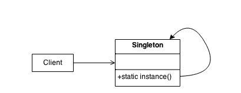

有些类有时候只需要生成一个实例，然后所有调用或引用该类的地方都对这一个类统一处理，这样的时候就需要使用单例模式，以防止产生复数个实例。具体的例子比如全局的配置类、全局的任务队列等，如果产生了多个实例就可能产生一些比较难以跟踪的bug。

## 应用场景

有的时候我们想要确保某个类不管被构造多少次只会返回同一个对象。

## 目的

保证某个类只有一个对象，并可以在全局获取。
封装懒汉式和饿汉式初始化。

## 结构



## 实现流程

单例模式要干涉的其实就是实例的构建过程，在构建实例之前，需要去检查是否已经生成过该实例，如果已经生成了，则直接返回之前生成的实例，如果没有，则构建新的实例，并将新实例进行记录。
这其中涉及到两个必要的过程：在某个地方记录已经构建的实例和在构建实例时去查看是否已构建实例。由于一个类检查是否已经构建过实例其实是这个类自己的职责，因此这个已经构建过的实例最好是由每个类单独维护。
python里，实例的构建是在`__new__`这个魔术方法中实现的。所以干涉构建的代码一般而言应该放在这里。

## 惰式和贪婪式构建

单例装饰器分为惰式和贪婪式，惰式指的是运行时构建，也即只有在实际代码中对单例类进行实例构建时才会构建，而贪婪式指的是导入时构建，也即一旦类被导入就为其构建单例实例。
惰式加载的优点是对内存占用较少，只有到有必要的时候才会构建实例，缺点是在多线程的情况下需要加锁才能保证单例。
贪婪式构建的优点是对内存的占用大，有时并不会使用的类其单例也会被构建，优点是多线程下不需加锁保证单例的安全性。

## 代码实现

### 单例类

```python
class Singleton:
    def __new__(cls, *args, **kwargs):
        if not hasattr(cls, '_instance'):   # 1
            cls._instance = super(Singleton, cls).__new__(cls, *args, **kwargs) # 2
        return cls._instanc 
```

1. 检查是否已有构建过的实例。
2. 如果没有构建过，则进行构建。

### 单例装饰器

```python
import functools

def singleton(cls):
    """
    Apply singleton design pattern to decorated class when used as decorator
    Sample Usage:
    @singleton
    def dummy_class():
        pass
    """
    instances = {}  # 1

    @functools.wraps(cls)   
    def get_instance(*args, **kw):  
        if cls not in instances:    # 2
            instances[cls] = cls(*args, **kw)   # 3
        return instances[cls]   # 4

    return get_instance # 5
```

1. 存储已经构建过的实例，不过存储地点转移到了装饰器里的闭包字典。
2. 检查是否已经构建过该类的实例。
3. 如果没有构建过则进行构建。
4. 从闭包字典中选择相应的实例返回。
5. 将装饰后的类返回，装饰后的类经过处理后其构建方法受到装饰器的劫持，构建过程必须经过get_instance方法的处理。
