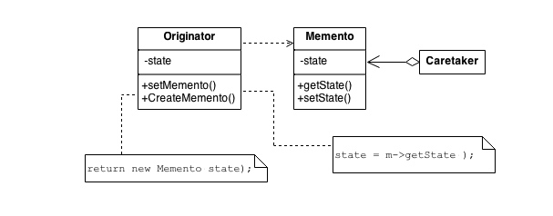

## 应用场景

希望保存一个对象的某个点的状态，在之后可以将对象返回到这个状态上来，从而实现回滚或是复原的功能。

## 目的

* 在不打破封装的前提下，捕获对象的当前状态，在稍后的时候可以返回到这个状态。
* 一个封装了存储点的魔法token。

## 结构



## 实现流程

1. 将需要备忘的对象当前状态存储。
2. 返回一个特殊的token，该token对应着将对象复原为备忘时状态的操作。

## 代码实现

```python
"""
http://code.activestate.com/recipes/413838-memento-closure/
Provides the ability to restore an object to its previous state.
"""

from copy import copy
from copy import deepcopy


def memento(obj, deep=False):
    state = deepcopy(obj.__dict__) if deep else copy(obj.__dict__)

    def restore():
        obj.__dict__.clear()
        obj.__dict__.update(state)

    return restore


class Transaction(object):
    """A transaction guard.
    This is, in fact, just syntactic sugar around a memento closure.
    """

    deep = False
    states = []

    def __init__(self, deep, *targets):
        self.deep = deep
        self.targets = targets
        self.commit()

    def commit(self):
        self.states = [memento(target, self.deep) for target in self.targets]

    def rollback(self):
        for a_state in self.states:
            a_state()


class Transactional(object):
    """Adds transactional semantics to methods. Methods decorated  with
    @Transactional will rollback to entry-state upon exceptions.
    """

    def __init__(self, method):
        self.method = method

    def __get__(self, obj, T):
        def transaction(*args, **kwargs):
            state = memento(obj)
            try:
                return self.method(obj, *args, **kwargs)
            except Exception as e:
                state()
                raise e

        return transaction


class NumObj(object):
    def __init__(self, value):
        self.value = value

    def __repr__(self):
        return '<%s: %r>' % (self.__class__.__name__, self.value)

    def increment(self):
        self.value += 1

    @Transactional
    def do_stuff(self):
        self.value = '1111'  # <- invalid value
        self.increment()  # <- will fail and rollback


def main():
    """
    >>> num_obj = NumObj(-1)
    >>> print(num_obj)
    <NumObj: -1>
    >>> a_transaction = Transaction(True, num_obj)
    >>> try:
    ...    for i in range(3):
    ...        num_obj.increment()
    ...        print(num_obj)
    ...    a_transaction.commit()
    ...    print('-- committed')
    ...    for i in range(3):
    ...        num_obj.increment()
    ...        print(num_obj)
    ...    num_obj.value += 'x'  # will fail
    ...    print(num_obj)
    ... except Exception:
    ...    a_transaction.rollback()
    ...    print('-- rolled back')
    <NumObj: 0>
    <NumObj: 1>
    <NumObj: 2>
    -- committed
    <NumObj: 3>
    <NumObj: 4>
    <NumObj: 5>
    -- rolled back
    >>> print(num_obj)
    <NumObj: 2>
    >>> print('-- now doing stuff ...')
    -- now doing stuff ...
    >>> try:
    ...    num_obj.do_stuff()
    ... except Exception:
    ...    print('-> doing stuff failed!')
    ...    import sys
    ...    import traceback
    ...    traceback.print_exc(file=sys.stdout)
    -> doing stuff failed!
    Traceback (most recent call last):
    ...
    TypeError: ...str...int...
    >>> print(num_obj)
    <NumObj: 2>
    """


if __name__ == "__main__":
    import doctest
    doctest.testmod(optionflags=doctest.ELLIPSIS)
```