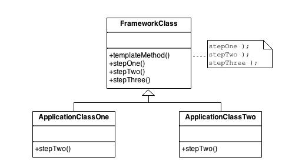

很多事情的流程中都会有固定不变的部分和可以被替换为其他做法的部分，这种时候为了消除代码的重复性，我们可以使用模板模式在主类中将不变的部分逻辑定下来，把可以改变的部分抽象封装为方法；在子类中覆写这些抽象封装的方法即可实现整个流程实现细节的变化，同时又消除了重复代码。这也体现了DIY不写重复代码的思想。

## 应用场景

在逻辑流程中有重复代码需要消除。需要动态改变算法实现的细节，但是不改动算法实现的整体结构。

## 目的

* 将操作的算法骨架定义出来，将某些步骤的代码代理给子类去处理。这样可以让子类在不改变算法结构的情况下，重新定义算法的某些步骤。
* 基类声明算法骨架，只提供骨架，细节由子类来实现。

## 结构



## 实现流程

1. 检查算法中哪些步骤是标准不变的、哪些部分是对每个子类而言特殊不同的。
2. 定义一个新的基类，在其中实现一个模板方法，用其实现算法的框架结构，调用各个步骤的方法。
3. 将标准不变的步骤方法在基类中实现。
4. 将对子类而言特殊的步骤方法在基类中定义抽象方法。
5. 每个新的子类继承该基类，并在其中实现当前子类所对应的特殊步骤方法。

## 与其他模式的异同

* 与策略模式相似，但是粒度与抽象层面不同。
* 模板模式用继承来改变算法的一个或多个步骤，策略模式用代理来改变整个算法。
* 模板模式改变的是整个类的逻辑，策略模式改变的是单独对象的逻辑。
* 工厂模式是模板模式的特例。

## 代码实现

```python
"""
An example of the Template pattern in Python
Defines the skeleton of a base algorithm, deferring definition of exact
steps to subclasses.
*Examples in Python ecosystem:
Django class based views: https://docs.djangoproject.com/en/2.1/topics/class-based-views/
"""


def get_text():
    return "plain-text"


def get_pdf():
    return "pdf"


def get_csv():
    return "csv"


def convert_to_text(data):
    print("[CONVERT]")
    return "{} as text".format(data)


def saver():
    print("[SAVE]")


def template_function(getter, converter=False, to_save=False):
    data = getter()
    print("Got `{}`".format(data))

    if len(data) <= 3 and converter:
        data = converter(data)
    else:
        print("Skip conversion")

    if to_save:
        saver()

    print("`{}` was processed".format(data))


def main():
    """
    >>> template_function(get_text, to_save=True)
    Got `plain-text`
    Skip conversion
    [SAVE]
    `plain-text` was processed
    >>> template_function(get_pdf, converter=convert_to_text)
    Got `pdf`
    [CONVERT]
    `pdf as text` was processed
    >>> template_function(get_csv, to_save=True)
    Got `csv`
    Skip conversion
    [SAVE]
    `csv` was processed
    """


if __name__ == "__main__":
    import doctest
    doctest.testmod()
```
