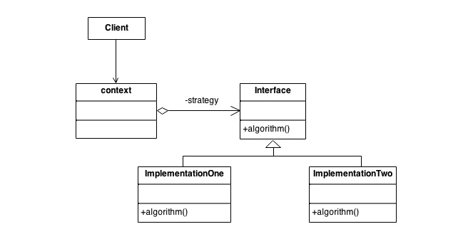

有的时候我们完成一件事有多种可能的做法，比如说获取数据库某张表的数据时我们可能想要按照某个字段筛选或是全部取出，比较两个字符串是否同义可以进行字符串比较或是检查二者是否互相包含等。如果之后我们可能会进一步添加额外的做法或者希望能在现有的几个做法之间灵活切换，我们就可以使用策略模式将具体的做法（也就是算法）部分进行封装抽象，把抽象出来的策略接口暴露给客户端，就可以完成客户端代码和具体实现之间的解耦。这也体现了面向接口编程，而不是面向实现编程的思想。
<!-- more -->

## 应用场景

想要灵活地修改代码的算法实现。

## 目的

* 定义一组算法，将他们各自封装起来，让他们可以互相替换，从而让更改算法与客户端代独立开来。
* 将细节封装进算法代码中，将算法接口暴露给外部。

## 结构



注意这里是java中的结构，由于java中方法必须依托于类存在，因此每个算法都要单独成一个类。在python中方法是一级对象，可以直接作为参数进行传递，因此在策略模式中不需要将具体策略封装为类，只要封装为函数然后作为参数传递即可。

## 实现过程

1. 识别客户代码需要进行灵活转换的算法部分。
2. 确定该算法接口的签名（入参、返回值）
3. 将具体的算法封装到接口中。
4. 将客户代码与接口代码耦合

## 与其他模式的异同

* 与模板模式有类似点，但是策略模式的粒度更细。
* 策略、状态、桥接模式三者结构相似，但是目的（要解决的问题）不同。
* 策略模式改变的是内部实现，装饰器模式改变的是外观。

## 代码实现

```python
"""
*What is this pattern about?
Define a family of algorithms, encapsulate each one, and make them interchangeable.
Strategy lets the algorithm vary independently from clients that use it.
Enables selecting an algorithm at runtime.
"""


class Order:
    def __init__(self, price, discount_strategy=None):
        self.price = price
        self.discount_strategy = discount_strategy

    def price_after_discount(self):
        if self.discount_strategy:
            discount = self.discount_strategy(self)
        else:
            discount = 0
        return self.price - discount

    def __repr__(self):
        fmt = "<Price: {}, price after discount: {}>"
        return fmt.format(self.price, self.price_after_discount())


def ten_percent_discount(order):
    return order.price * 0.10


def on_sale_discount(order):
    return order.price * 0.25 + 20


def main():
    order0 = Order(100)
    order1 = Order(100, discount_strategy=ten_percent_discount)
    order2 = Order(1000, discount_strategy=on_sale_discount)
    print(order0)
    print(order1)
    print(order2)


if __name__ == "__main__":
    main()


OUTPUT = """
<Price: 100, price after discount: 100>
<Price: 100, price after discount: 90.0>
<Price: 1000, price after discount: 730.0>
"""

```
