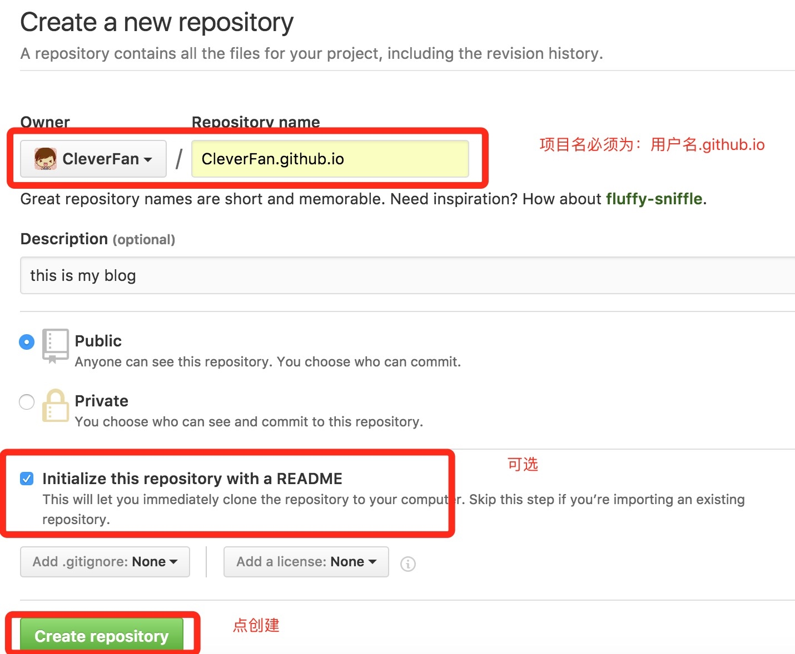
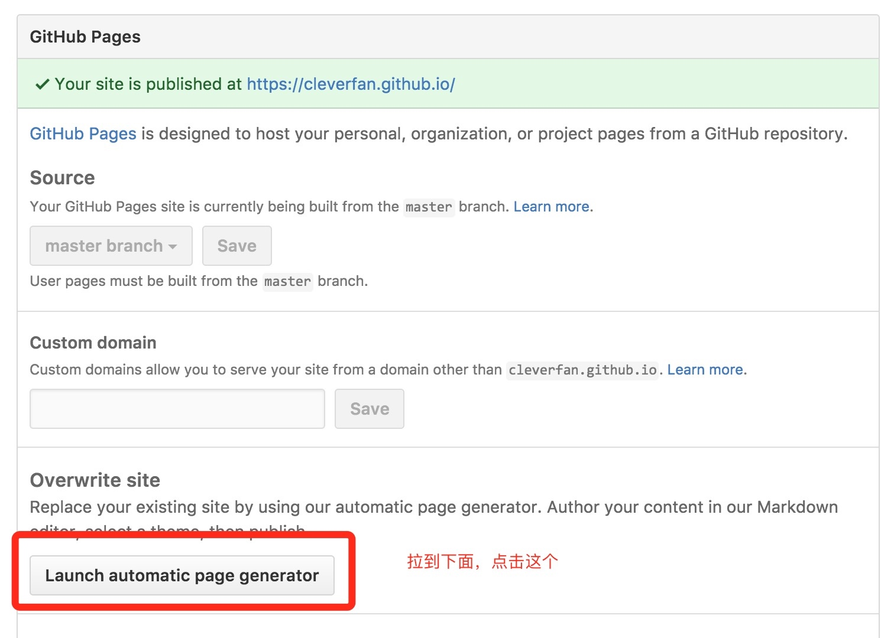
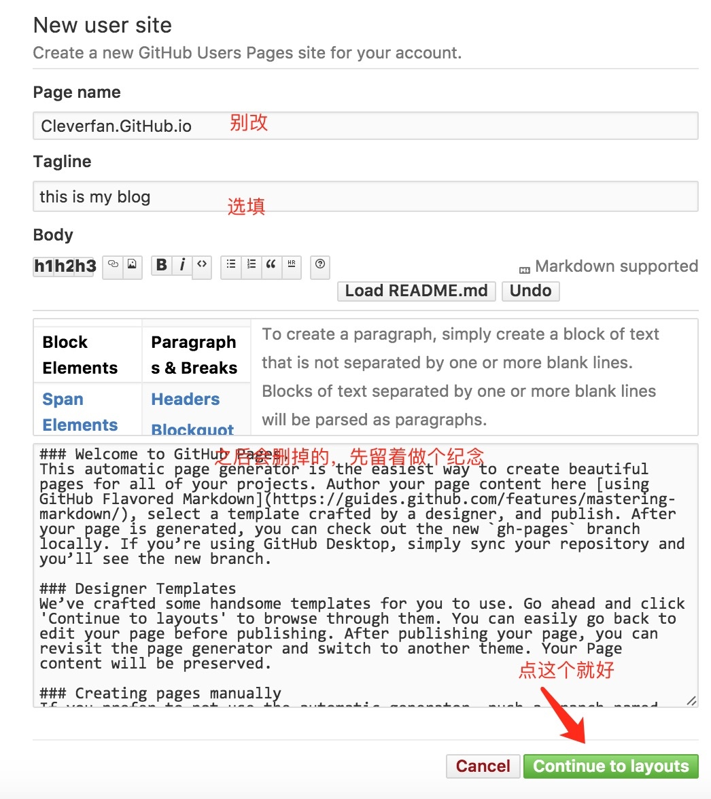
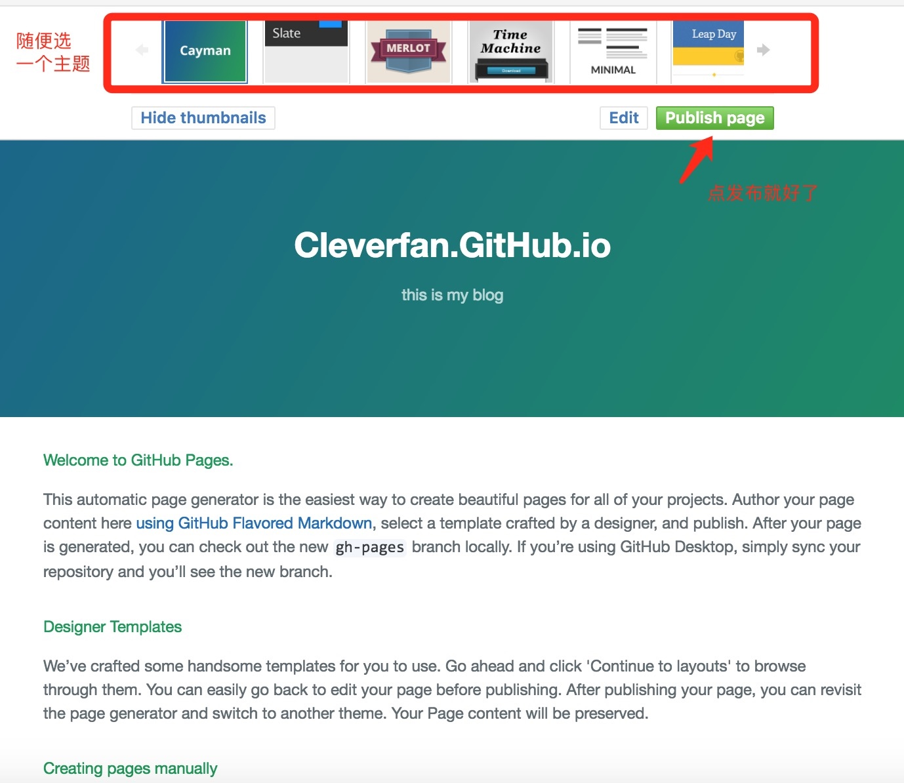

## Hexo的搭建和使用

[官方文档](https://hexo.io/zh-cn/docs/commands.html)
Hexo是一个根据本地markdown文档和html文件生成静态网站的框架工具，能够用简单的指令简化静态网站管理流程。
<!-- more -->

### 安装Hexo环境

**安装nodejs** `http://nodejs.cn/`
**安装git** `https://git-scm.com/downloads`
**安装Hexo** `npm install -g hexo-cli`

### 建立项目

```yml
hexo init <folder>
cd <folder>
npm install
```

以上命令会在folder文件夹中新建所有hexo需要的文件。

### 文件目录

建立好的项目其文件目录如下：

```yml
.
├── _config.yml
├── package.json
├── scaffolds
├── source
|   ├── _drafts
|   └── _posts
└── themes
```

**_config.yml** 存放网站的配置信息。
**package.json** 渲染网站时hexo依赖的配置。
**scaffolds** 模板文件夹，存放新建文章的模板。
**source** 存放用户资源。除了drafts和posts，其他开头为_的文件盒文件夹都会被忽略。其他的markdown和html。
**theme** 主题文件夹，存放主题文件。

### 指令一览

**新建文章** `hexo new <title>` 新建一篇文章。标题中的空格要用引号括起来。
**根据现有文档生成静态文件** `hexo generate`或是`hexo g`。加上`-d`则为生成文件后立即部署到网站。
**启动本地静态网站服务** `hexo server`，默认地址为http://localhost:4000/
**部署到远端网站** `hexo deploy`或是`hexo d`。加上`-g`则为先生成静态网站再部署。
**清楚缓存和静态文件** `hexo clean`用于在网站缓存或静态文件出错时。
**列出网站资料** `hexo list`

### 主题选择

首先需要在项目的themes文件夹下建立与主题名同名的文件夹，其中放入主题的相应文件。
之后再配置文件中修改them字段为主题的名字，有的主题有对应的scheme，可以相应进行添加。
然后清除缓存，重新生成静态文件。

## 使用GitPage存放博客文件

#### 创建gitpage项目


项目的名字必须是`用户名.github.io`

#### 在项目中创建page

在刚建立好的项目中，


选择一个主题

之后GitPage网站就建立好了

#### 将Hexo代码部署到github上

修改hexo的配置文件，将其Deployment部分修改为：

```yml
deploy:
    type: git
    repo: https://github.com/USERNAME/USERNAME.github.io.git
    branch: master
```

修改完成后用hexo部署一下即可。

## 后续

这里只是配置好了基本的hexo主题博客，满足了日常写博客发布的需求。
下一篇博文会继续讲解如何在博客中加入更多的定制化功能。
